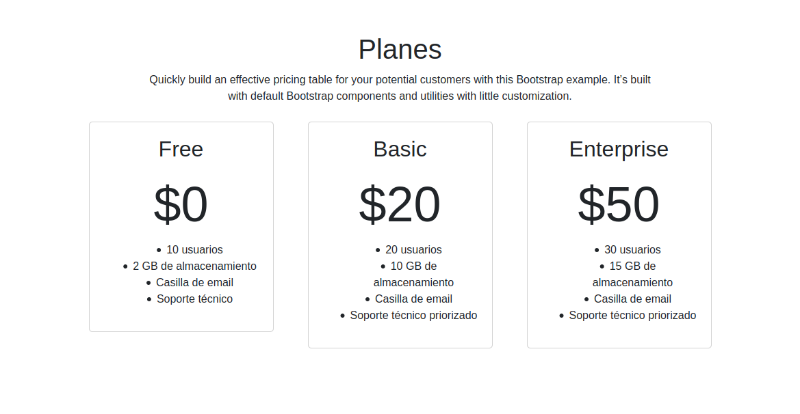
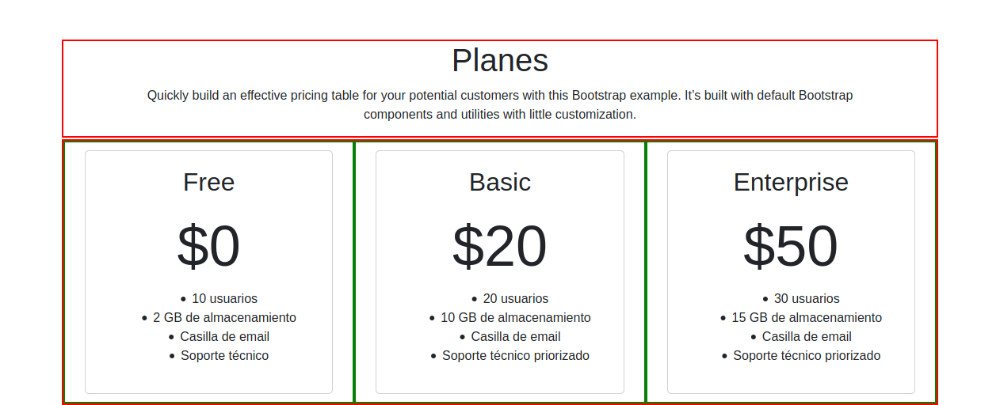

# Ejercicios Bootstrap

### Sobre la plantilla

Para todos los ejercicios partiremos [plantilla de proyecto para Bootstrap](https://minhaskamal.github.io/DownGit/#/home?url=https://github.com/pabab/apuntes_proa/tree/master/bootstrap/bootstrap_base_template). Deberán utilizar una nueva copia de la plantilla para cada ejercicio y renombrar la carpeta del proyecto a *ejercicio1*, *ejercicio2*, *ejercicio3*, etc.

La plantilla de proyecto tiene la siguiente forma:
* **index.html**: en este archivo deberán escribir el HTML del proyecto
* **css/**: en esta carpeta deben colocar las hojas de estilo del proyecto, las cuales también deberán enlazar en el código HTML.
* **img/**: en esta carpeta deben depositar las imágenes que utilicen dentro del proyecto.
* **js/**: en esta carpeta irán los archivos de código Javascript (no vamos a utilizarla por ahora).
* **vendor/**: en esta carpeta se incluyen archivos .css y .js que conforman las bibliotecas que se incluyen en la plantilla (Bootstrap, JQuery, Popper, etc.)

### Intro

Los contenedores son los elementos básicos para crear layouts en bootstrap y deben emplearse para hacer uso del sistema de grilla.
Existen dos clases de contenedores:

* * *container*: su ancho máximo (*max-width*) cambia para cada breakpoint de la grilla responsiva de Bootstrap.
* *container-fluid*: siempre ocupa el 100% del ancho del viewport.

Para crear un elemento de tipo *container* se utiliza un elemento de tipo **div** y se le asigna la clase *container*:

```html
<div class="container">
  <!-- Content here -->
</div>
```

Documentación de Bootstrap sobre los contenedores: https://getbootstrap.com/docs/4.0/layout/overview/

 Además de los contenedores, las páginas desarrolladas se organizar en filas y columnas. **Lo único que puede ir dentro de un contenedor son filas (elementos con la clase row)**. **Lo único que puede ir dentro de un elemento fila son columnas (elemento con algunas de las clases col-*)**. Dentro de las columnas se puede agregar el contenido (títulos, texto, otros contenedores, etc).

Por ejemplo, para crear un layout de 2 columnas de igual ancho se puede utilizar el siguiente código.

```html
<div class="container">
  <div class="row">
    <div class="col">
      1 of 2
    </div>
    <div class="col">
      2 of 2
    </div>
  </div>
</div>
```

Además, se puede especificar el ancho de las columnas, por ejemplo, que la segunda tenga un ancho igual al doble de la primera:

```html
<div class="container">
  <div class="row">
    <div class="col-md-4">
      1 of 2
    </div>
    <div class="col-md-8">
      2 of 2
    </div>
  </div>
</div>
```

**¡Importante! La suma de los anchos de las columnas siempre debe sumar 12.**

Al especificar el tamaño de las columnas se pueden utilizar los prefijos:

* col-xs-*: para cuando el display es extra chico (width < 576px)
* col-sm-*: para cuando el display es pequeño (width >= 576px)
* col-md-*: para cuando el display es mediano (width >= 768px)
* col-lg-*: para cuando el display es grande (width >= 960)
* col-xl-*: para cuando el display es extra grande (width >= 1140px)

Consultar la documentación de Bootstrap en: https://getbootstrap.com/docs/4.0/layout/grid/


## Ejercicio 1: Container vs Container Fluid

Cree un documento con dos elementos **div** del tipo container, el primero debe ser de tipo *container-fluid* y el segundo de tipo *container*.

Dentro del primer contenedor debe ir un título (h1) que diga "Ejercicio 1". Dentro del segundo coloque un subtítulo (h2) que diga "Container vs container-fluid".

Además, al primer contenedor agregar la clase *rojo* y al segundo contenedor la clase *verde* (recordar que un elemento puede tener más de una clase especificada en su atributo *class* y que los nombres de las mismas deben separarse por espacios). Cree y enlace una hoja de estilos en el archivo *css/styles.css* y en dicha hoja especifique los siguientes atributos para las clases.

La clase *rojo* debe tener un borde de 2px, sólido, de color rojo, y un padding de 10px.
La clase *verde* debe tener un borde de 2px, sólido, de color verde, y un padding de 10px, y un color de fondo verde claro.

Recuerde que para crear reglas de estilo que se apliquen a una clase se debe especificar el nombre de la misma anteponiendo . (punto), por ejemplo:

```css
.rojo{

}
```

Una vez finalizado el ejercicio, redimensione la ventana del navegador para observar el cambio en el ancho de ambos contenedores.

## Ejercicio 2: Ejemplo responsive con colores
Crear una página con Bootstrap 


## Ejercicio 3: Página sobre planes de un servicio
Un cliente nos pidió que desarrollemos una página para exhibir los costos mensuales de los distintos planes que ofrece para su servicio.

La página debe verse asÍ:

 

Implemente la página utilizando Bootstrap de manera que esté compuesta por 2 filas. La primer fila deberá tener con una única columna que abarque todo el ancho. La segunda fila estará compuesta por 3 columnas, una para cada plan. Dicha disposición se puede observar en la siguiente imagen:

 

Además:

* Cree una regla de estilo que aplique, para todos los elementos que tengan la clase *centrado* el atributo ```text-align: center;``` . Utilice luego la clase *centrado* para aplicarla a los distintos elementos cuyo contenido se encuentra centrado.
* Cree una regla de estilo que aplique, para todos los elementos que tengan la clase *precio-big* el atributo ```font-size: 72px;``` . Aplique luego la clase *precio-big* al elemento que muestra el precio de cada plan para que se vea más grande.
* El contenido de cada una de las columnas debe ir envuelto en un elemento **div** con la clase *cuadro*. Cree una regla de estilo que aplique a la clase **cuadro* las siguientes propiedades:
  * padding: 20px;
  * margin: 10px;
  * border: 1px solid lightgray;
  * border-radius: 5px; 

