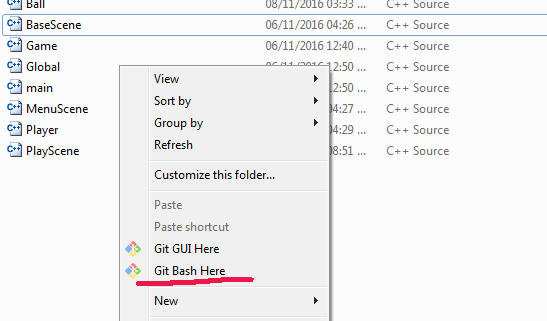
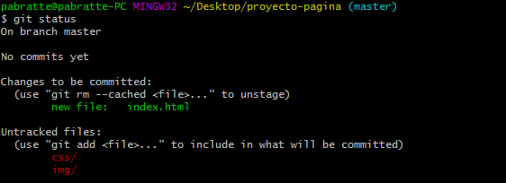
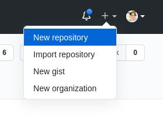

# Apunte Git

### 1. Instalar git

Descargar el instalador desde [aquí](https://git-scm.com/). Las opciones por defecto del instalador están bien.

### 2. Configurar usuario y email

Git necesita esta información para saber quién hace los commits. Sólo necesitaremos correr estos comandos por única vez.

```bash
git config --global user.name "<your-full-name>"
git config --global user.email "<your-email-address>
```

Se debe reemplazar `your-full-name`por el nombre completo del usuario y `your-email-address`por la dirección de correo.

### 3. Abrir una consola en el directorio del proyecto

Todos los comandos de git se escriben en una consola de comando. Para abrir una consola de comando en el directorio de nuestro proyecto debemos hacer **clic con el botón derecho** en el explorador y elegir la opción **Git Bash Here**.



### 4. Inicializar un repositorio local

Existen varias opciones para inicializar un repositorio. La que nos interesa ahora es crear un repositorio de git en una carpeta **donde ya existen nuestros archivos del proyecto**.

En la consola escribimos el siguiente comando:

```bash
git init .
```

Si todo sale bien veremos un mensaje como el siguiente.


### 5. Consultando el estado actual del repositorio

Existen varias opciones para inicializar un repositorio. La que nos interesa ahora es crear un repositorio de git en una carpeta **donde ya existen nuestros archivos del proyecto**.

En la consola escribimos el siguiente comando:

```bash
git status
```

La salida debería ser algo similar a lo que se observa en la siguiente imagen.



Git nos muestra en verde los archivos que estan agregados a la **fase de staging**, es decir los cambios marcados para ser archivados y en rojo los archivos que están aún fuera del control de cambios.

### 6. Agregando archivos a la fase de staging

Podemos imaginar a los **commits** como:

* una foto que sacamos de nuestro proyecto en un momento dado. 
* o una caja que contiene un montón de objetos que queremos guardar.

En ese sentido, la **fase de staging** sería el equivalente a ir poniendo en la caja los objetos que queremos guardar o ir pidiéndole a la gente que se forme y prepare para sacar la fotogragía.


Para agregar archivos del proyecto a la fase de staging escribimos el comando `git add` seguido por el nombre de los archivos que queremos agregar, por ejemplo:

```bash
git add index.html
```

### 7. Realizando un commit

Si agregar archivos al **staging** fuera poner los objetos que queremos guardar dentro de una caja, **hacer un commit** sería como cerrar la caja con cinta y ponerle una etiqueta que dice lo que hay guardado dentro.


Al hacer un commit se guarda el estado actual del proyecto. Esto permite hacer muchas cosas como rastrear los cambios del código entre diferentes commits, volver el proyecto a un punto anterior, etc.

Una vez que se agregaron todos los archivos relevantes a **staging**, se puede hacer un commit con el siguiente commando:

```bash
git commit -m "mensaje del commit"
```

Cada commit debe ir acompañado de un mensaje corto que describa en qué consisten los cambios que se almacenaron (la etiqueta de la caja).

### 8. Enviando los cambios a un servidor remoto

Hasta el momento todos cambios que realizamos son locales. Es decir, los commits realizados en el repositorio sólo se encuentran almacenados en nuestra computadora.

Enviarlos a un repositorio remoto (operación que se conoce como `push`) nos permite resguardar una copia nuestro trabajo y compartirlo con otros.

Como metáfora, podemos pensar en los `push` como si juntaramos todas las cajas cerradas y etiquetadas de nuestros cambios y las subieramos a un camión de delivery para entregarlas en otro lado.  


Para enviar nuestros cambios a un repositorio remoto, primero necesitamos uno. [GitHub](https://github.com) es un servicio que nos permite almacenar nuestros repositorios en la nube y trabajar de manera conjunta con otros programadores, además de muchas más funcionalidades extra.

Una vez que tengamos una cuenta en GitHub podemos crear un nuevo repositorio utilizando el menú en la esquina superior derecha:



Una vez que hayamos creado nuestro repositorio, el mismo estará vacío. Github nos mostrará una ayuda con los comandos que debemos ejecutar para enlazar nuestro proyecto local con GitHub. Los comandos son los siguientes:

```
git remote add origin git@github.com:pabratte/repositorio-de-prueba.git
```

Nuestro repositorio local puede tener referencias a múltiples repositorios remotos, por lo que debemos asignar un nombre para cada repositorio remoto que configuremos. El comando anterior sirve para gestionar los repositorios remotos (`git remote`) agregando (`add`) un nuevo repositorio remoto con el nombre `origin` cuya URL es `git@github.com:pabratte/repositorio-de-prueba.git` (éste último parámetro es proporcionado por GitHub y puede variar).

Agregar un nuevo repositorio remoto es una operación que **se debe realizar por única vez**.

El segundo comando es el siguiente:

```
git branch -M main
```

El comando crea una rama llamada `main`. Todos los commits que hacemos están englobados dentro de alguna rama. Si no existe ninguna rama debemos crear una.

Crear una nueva rama es una operación que **se debe realizar por única vez**.

Finalmente, el último comando, y el que realmente envía los cambios al servidor, es el siguiente:

```
git push origin main
```

El comando realiza un push de **todos** los commits realizados hasta el momento hacia la rama `main` del repositorio remoto al que nombramos `origin`.