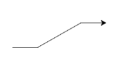

class: center, middle, inverse, layout
# Procedimientos con Python Turtle
## Programación I

---

class: inverse
layout: true

---

# Turtle

<cite>
Turtle graphics is a popular way for introducing programming to kids. It was part of the original Logo programming language developed by Wally Feurzeig, Seymour Papert and Cynthia Solomon in 1967.
</cite>

```python
import turtle

turtle.forward(50)  # avanza 50 pixeles
turtle.left(30)     # dobla a la izquierda 30 grados
turtle.forward(100) # avanza 100 pixeles
turtle.right(30)    # dobla a la derecha 30 grados
turtle.forward(50)  # avanza 50 pixeles
```

<div style="text-align: center;">
  
</div>

---
 
# Logo


<div style="text-align: center;">
  
</div>


---

# Dibujar un cuadrado

.left-column50[
```python
import turtle

turtle.forward(30)
turtle.left(90)
turtle.forward(30)
turtle.left(90)
turtle.forward(30)
turtle.left(90)
turtle.forward(30)
turtle.left(90)
```
]
.right-column50[
<div style="text-align: center; margin-top: 20px;">
  
</div>
]
---
# DEFINIR una función

```python
import turtle

# definir la función
def dibujar_cuadrado():
    turtle.forward(30)
    turtle.left(90)
    turtle.forward(30)
    turtle.left(90)
    turtle.forward(30)
    turtle.left(90)
    turtle.forward(30)
    turtle.left(90)
```

**Sintáxis** para definir una función:
1. Se utiliza la palabra reservada **def**
2. Se escribe el nombre de la función
3. Se escriben paréntesis al final del nombre
4. Se escriben los dos puntos (:) para enumerar las acciones del bloque
5. Las acciones que forman parte de la función llevan **indentado** 

**IMPORTANTE**: El código **define** la función. No la ejecuta

---

# UTILIZAR (invocar) una función


```python
dibujar_cuadrado()
```

**Sintáxis** para invocar una función:
1. Se escribe el nombre de la función
3. Se escriben paréntesis al final del nombre

**IMPORTANTE**:
* Cuando invocamos a una función, la ejecución sigue por las órdenes que están dentro de la misma
* La función tiene que ser definida **antes** (arriba) de donde se utiliza
---

# Ejemplo: dibujar una flor

<div style="text-align: center;">
  
</div>

<a href="turtle_flower.py" target="_blank">Descargar código del ejemplo</a>

---

# Ejercicio

Dibujar un muñeco o personaje utilizando procedimientos para las distintas partes de su cuerpo (brazos, manos, cabeza, etc).

* Utilizar mínimo 4 procedimientos

**IMPORTANTE para la entrega** 

* El archivo debe tener como nombre *apellido_del_alumno*.py (todo en minúsculas)
* Debe existir una función que realice todo el dibujo completo (como por ej: dibujar flor) y que se llame personaje_*apellido_del_alumno*

**POR FAVOR Respetar esas convenciones**

### Sean creativos!!!

<a href="https://docs.python.org/3/library/turtle.html" target="_blank">Documentacion turtle</a>

