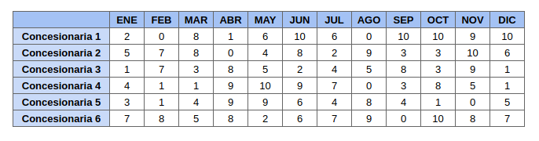

# Ejercicio

Una empresa de venta de autos tiene varias concesionarias distribuidas en distintos puntos de la ciudad. En la siguiente tabla se observan la **cantidad de autos vendidos** por cada concesionaria (filas) en cada uno de los meses (columnas) del 2019.

Escriba el código para realizar las siguientes acciones:

1. Representar los datos mediante una matriz en Python.

2. Averiguar **cuántos autos** se vendieron en el mes de **junio** teniendo en cuenta todas las concesionarias (se debe utilizar un bucle).

3. El usuario debe ingresar un número de concesionaria (0-5) y el programa debe mostrar **cuántos autos vendió dicha concesionaria** teniendo en cuenta todos los meses  (se debe utilizar un bucle).

4. Contar la **cantidad** de concesionarias que vendieron **más de 5 autos** durante el mes de octubre (se debe utilizar un bucle).
5. Conocer cuál fue el mes en el que la Concesionaria 5 vendió **mayor** cantidad de autos.