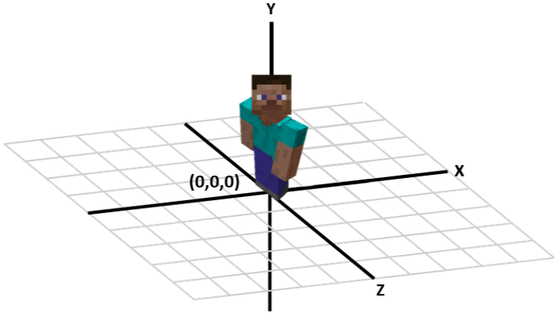

class: center, middle, inverse, layout
# Matrices 3D con Minecraft

## Programación I

<center>

</center>

---

class: inverse
layout: true

---


# Arreglos 1D, 2D, 3D

<center style="background: white;">

</center>

---


# Arreglos 3D

<center style="background: white;">

</center>


De la misma forma que podemos pensar en un arreglo 2D o Matriz como **una lista de listas**,
podemos pensar a una matriz 3D como **una lista de matrices apiladas** que forman un espcio 3D.
---

# Minecraft como una matriz 3D

<center>

</center>

---

# Sistema de coordenadas en Minecraft

<center>
	
</center>

---

# RaspberryJam Mod

* Es un MOD de Minecraft (**mod**ifica el comportamiento original del juego)
* Hace que el juego **escuche** por comandos utilizando un protocolo llamado JUICE
* Desde Python utilizamos una biblioteca (mcpi) que **se comunica con el juego** utilizando el protocolo JUICE

---

# Ejemplo: obtener la posición del jugador
```python
from mcpi.minecraft import Minecraft
from mcpi import block

mc = Minecraft.create()	# crear un objeto mc para comunicarse con el juego
pos = mc.player.getPos()	# obtener la posición del jugador
print(pos)
```
---

# Ejemplo: poner un bloque arriba del jugador
```python
from mcpi.minecraft import Minecraft
from mcpi import block

mc = Minecraft.create()	# crear un objeto mc para comunicarse con el juego
pos = mc.player.getPos()	# obtener la posición del jugador
mc.setBlock(pos.x, pos.y + 2, pos.z, block.DIRT.id) # coloca un bloque
```

---

# Ejemplo: mostrar la posición del jugador en tiempo real

```python
from mcpi.minecraft import Minecraft
from mcpi import block
import time

mc = Minecraft.create()
while True:
    pos = mc.player.getPos()
    print(pos)
    time.sleep(1)
```

---

# Ejemplo: dejar flores al caminar

```python
from mcpi.minecraft import Minecraft
from mcpi import block
import time

mc = Minecraft.create()
while True:
    pos = mc.player.getPos()
    mc.setBlock(pos.x, pos.y, pos.z, block.FLOWER_YELLOW.id)
    time.sleep(1)
```

---


# Ejemplo: construir una torre

```python
from mcpi.minecraft import Minecraft
from mcpi import block
import time

mc = Minecraft.create()
pos = mc.player.getPos()

for i in range(10):
    mc.setBlock(pos.x+1, pos.y+i, pos.z+1, block.STONE.id)
    time.sleep(0.2)
```

---


# Tipos de bloques

* STONE
* GRASS
* DIRT
* WATER
* LAVA
* GLASS
* ICE
* TNT

[Referencia de la API](https://www.stuffaboutcode.com/p/minecraft-api-reference.html)

---

# Desafíos

1. Crear una **torre**, es decir una sucesión de no menos de 10 bloques apilados verticalmente (en el eje Y). **Deben utilizar bucles**. 
Puede ser de un solo bloque de ancho como en el ejemplo o de más. Pueden agregar otros detalles. Sean creativos!

2. Crear una **puente**, es decir una sucesión de no menos de 20 bloques apilados horizontalmente (en X o en Z). **Deben utilizar bucles**. **Deben utilizar el puente para superar algún obstáculo del escenario** 
Puede ser de un solo bloque de ancho o de más. Pueden agregar otros detalles. Sean creativos!

3. 2. Crear una **escalera**, es decir una sucesión bloques en zig-zag que permitan al jugador subir. **Deben utilizar bucles**. **Deben utilizar la escalera para superar algún obstáculo del escenario** 
 Sean creativos!

4. **OPCIONAL**: Crear una pared de bloques utilizando bucles.

---

# Entrega

**Grabar un video** o screencast en donde **se ejecute** el código de cada desafío, **se explique** el funcionamiento del código y **se utilice** la estructura creada en alguna parte del escenario. 


