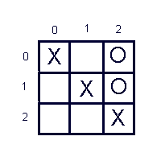
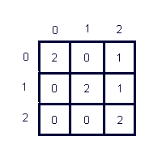

class: center, middle, inverse, layout
# Matrices

## Programación I

---

class: inverse
layout: true

---


# Matrices

Las matrices o tablas (arreglos bidimensionales) son una **disposición rectangular de elementos**, es decir en **filas** y **columnas**.

<center>

</center>

* En las listas cada elemento se accede por su **posición dentro de la lista**
* En las matrices por **2 números**: **fila** y **columna**.
* Al igual que en las listas, los números de fila y columna **empiezan a partir del 0**.

---

# Ejemplos de uso de matrices
	
.left-column50[
<center>

</center>
]
.right-column50[
<center>

</center>
]
---

# Ejemplos de uso de matrices

<center>

</center>


---

# Ejemplos de uso de matrices

<center>

</center>

* Filas	=>	Países
* Columnas 	=> 	Tipos de medallas

---


# Matrices en Python

## Crear una matriz

```python
cosas = [
        [0, 1, 2],
        [3, 4, 5],
        [6, 7, 8],
        ]
```
* Podemos entender a las matrices como **una lista** en la cual **cada elemento es otra lista**


---
# Matrices en Python

## Crear una matriz

```python
cosas = [          // lista "grande" (matriz)
        [0, 1, 2], // lista1 (fila1)
        [3, 4, 5], // lista2 (fila2)
        [6, 7, 8], // lista3 (fila3)
        ]          // fin de la lista "grande" (matriz)
```

* Podemos entender a las matrices como **una lista** en la cual **cada elemento es otra lista**
* RECORDAR: los elementos de una lista se separan entre sí con comas (,)
---

# Matrices en Python

## Crear una matriz (otra forma)

```python
matriz = []               // lista "grande" (matriz)
for i in range(0, 3):     // vamos a crear una matriz de 3 filas
    fila = []             // lista para almacenar una fila de la matriz
    fila.append(input())  // cargamos un dato en la fila
    fila.append(input())  // cargamos un dato en la fila
    fila.append(input())  // cargamos un dato en la fila
    matriz.append(fila)   // AGREGAMOS LA FILA A LA MATRIZ
```

* Podemos entender a las matrices como **una lista** en la cual **cada elemento es otra lista**
* RECORDAR: los elementos de una lista se separan entre sí con comas (,)

---

# Matrices en Python

## Acceder a una celda
```python
cosas = [          // lista "grande" (matriz)
        [0, 1, 2], // lista1 (fila1)
        [3, 4, 5], // lista2 (fila2)
        [6, 7, 8], // lista3 (fila3)
        ]          // fin de la lista "grande" (matriz)
elemento = cosas[1][2]
print("El elemento en la fila 1 col 2 es {}".format(elemento))
```

---

# Matrices en Python

## Recorrer una fila

```python
cosas = [          // lista "grande" (matriz)
        [0, 1, 2], // lista1 (fila1)
        [3, 4, 5], // lista2 (fila2)
        [6, 7, 8], // lista3 (fila3)
        ]          // fin de la lista "grande" (matriz)

print("Los elementos de la fila 1 son: ")
for j in range(0, 3):
    print(cosas[1][j])
```

* El indice correspondiente a la **fila** que quiero mostrar (1) queda fijo
* El indice correspondiente a las **columnas (j)** varía entre 0 y la cantidad de columnas


---

# Matrices en Python

## Recorrer una columna

```python
cosas = [          // lista "grande" (matriz)
        [0, 1, 2], // lista1 (fila1)
        [3, 4, 5], // lista2 (fila2)
        [6, 7, 8], // lista3 (fila3)
        ]          // fin de la lista "grande" (matriz)

print("Los elementos de la columna 1 son: ")
for i in range(0, 3):
    print(cosas[i][1])
```

* El indice correspondiente a la **columna** que quiero mostrar (1) queda fijo
* El indice correspondiente a las **filas** (i) varía entre 0 y la cantidad de filas


---

# Matrices en Python

## Ejercicio

Juan, Pedro y Pablo participaron en una olimpiada escolar que incluyó las siguientes disciplinas: Informática, Matemática y Lengua. En la siguiente tabla se puede observar el puntaje que cada estudiante obtuvo en cada una de las disciplinas.

<center>

</center>

---

# Matrices en Python

## Ejercicio

1. Escribir el código en Python para representar los datos. RECORDAR: los datos que se almacenan en la matriz son los puntajes (no los nombres de los estudiantes ni las disciplinas)

2. Escribir el código para mostrar cuántos puntos obtuvo **Pedro** en **Lengua**

3. Escribir el código para mostrar cuántos puntos obtuvo **Juan en total**, es decir, teniendo en cuenta las tres disciplinas (sumar la fila correspondiente a Juan)

4. Escribir el código para mostrar cuantos puntos obtuvieron entre todos los estudiantes en la disciplina Informática (sumar la columna)


