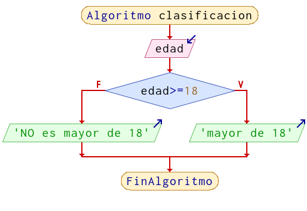
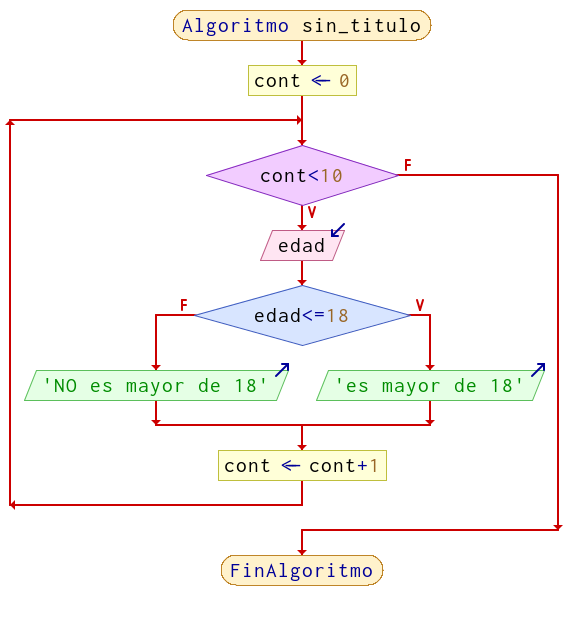

class: center, middle, inverse, layout
# Clasificar elementos en C++

## Taller Laboratorio

---

class: inverse
layout: true

---


# Problema

En un curso de **10 estudiantes** se desea conocer **cuántos** de ellos son **mayores de edad** y cuantos son menores. Escriba un algoritmo que solicite al usuario **la edad de cada uno de los estudiantes** y muestre por pantalla la **cantidad de mayores de edad**.


---

# Clasificar 1 solo estudiante
<center>

</center>

---

# Clasificar 1 solo estudiante

```
int edad;
cout<<"Ingrese la edad del estudiante: ";
cin>>edad;
if(edad >= 18){
	// el estudiante es mayor de 18
}else{
	// el estudiante NO es mayor de 18
}

```

---

# Clasificar 10 estudiantes

El código anterior dentro de un bucle

<center>

</center>

---

# Clasificar 10 estudiantes

El código anterior dentro de un bucle

```
for(int cont = 0; cont<10; cont++){
	int edad;
	cout<<"Ingrese la edad del estudiante: ";
	cin>>edad;
	if(edad >= 18){
		cout<<"el estudiante es mayor de 18"<<endl;
	}else{
		cout<<"el estudiante NO es mayor de 18"<<endl;
	}
}

```

---

# Volver al problema

En un curso de 10 estudiantes se desea conocer **cuántos** de ellos son mayores de edad y cuantos son menores. Escriba un algoritmo que solicite al usuario la edad de cada uno de los estudiantes y muestre por pantalla la **cantidad** de mayores de edad.


---

# Clasificar 10 estudiantes

El código anterior dentro de un bucle

```
int edad;
int cont_mayores = 0;
int cont_menores = 0;
for(int cont = 0; cont<10; cont++){
	cout<<"Ingrese la edad del estudiante: ";
	cin>>edad;
	if(edad >= 18){
		cont_mayores = cont_mayores + 1;
	}else{
		cont_menores++;
	}
}
cout<<"La cantidad de mayores de 18 es: "<<endl;
```

---

# Ejecutar en el depurador

Veamos cómo funciona el algoritmo en el depurador.

Los datos de entrada (edades) serán los siguientes:


15, 17, **18**, **19**, 16, **20**, 14, **21**, 15, 16


El resultado debería ser:

**4**

---

# Algunas cosas que tener en cuenta

* Se utilizan 3 contadores diferente para cosas distintas:
	- cont: para la cantidad de veces que se ejecuta el bucle (se incrementa siempre)
	- cont_mayores: para la cantidad de **estudiantes mayores hasta el momento** (se incrementa a veces)
	- cont_menores: para la cantidad de **estudiantes menores hasta el momento** (se incrementa a veces)
	
* Cuando leemos una nueva edad *el valor anterior se pierde*, pero no importa porque lo que nos interesa (si es o no mayor de 18) queda guardado en otra variable.

* Los resultados se muestran **una vez clasificados los 10 estudiantes**, es decir, **fuera del bucle** (¿qué pasa si los mostramos dentro?)


---

## Ejercicios

### Ejercicio 1

Escriba un programa que solicite al usuario ingresar 10 valores numéricos y muestre luego por pantalla **cuántos** de los valores ingresados resultaron mayores a 100.

### Ejercicio 2

En una fábrica de tornillos, una de las máquinas que los fabrica a veces tiene errores y produce tornillos más largos o más cortos de lo deseado. Se sabe que, para ser considerados como una pieza válida, los tornillos deben tener un largo que puede variar entre los **9.1cm y 13.4cm**. Se necesita escribir un programa para el **control de calidad** de la producción de tornillos.
El programa debe recibir como entrada la longitud de **20 tornillos** e informar **cuántos de ellos pasaron el control de calidad** (es decir, su largo estuvo dentro del rango correcto) y pueden comercializarse.

### Ejercicio 3 (sigue)
---

## Ejercicios


### Ejercicio 3

Un grupo de personas acaba de tomar un examen para obtener su carnet de conductor. El examen lleva una calificación entre 1 y 10 y se aprueba con una nota de 7 o más. Se necesita crear un programa para calcular el **porcentaje de aprobados** entre las 12 personas que tomaron el examen. Para ello se leen como datos el nombre y calificación de cada una. El programa debe calcular e informar el porcentaje de personas que aprobaron.


