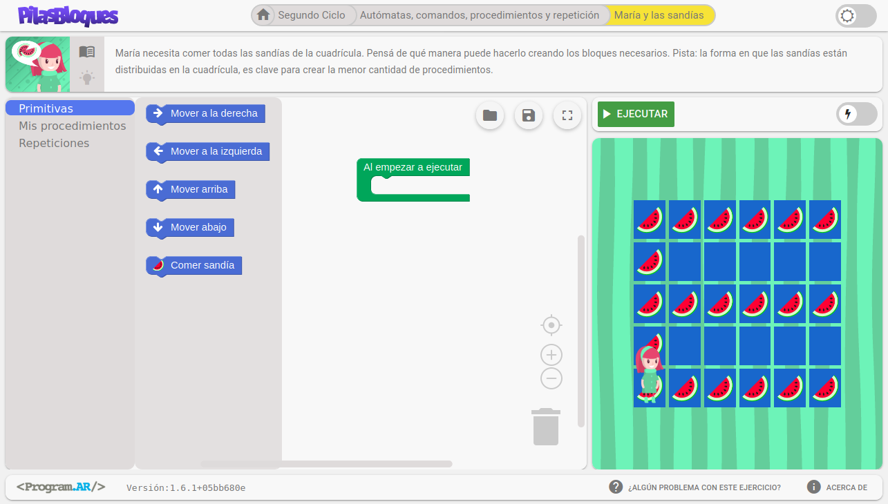
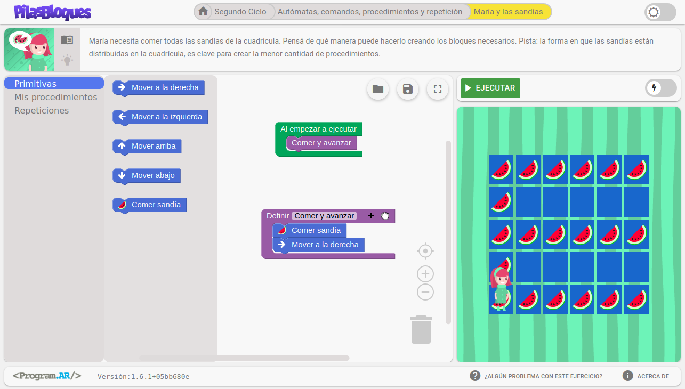

# Introducción a modularización con Pilas Bloques

## María y las Sandías

Vamos a resolver el desafío [María y las sandías](http://pilasbloques.program.ar/online/#/desafio/8), en el cual María debe comer todas las sandías que hay en el escenario. 

Al observar el desafío:
* ¿Qué conjuntos de acciones identifican que se repiten?
* ¿Qué patrones observan?
* ¿Qué instrucciones piensan que se podrían agrupar en una especie de *superinstrucción*? 
 
## Procedimientos

Un procedimiento es un **conjunto de instrucciones agrupadas bajo un nombre**.

Cuando al ejecutar un algoritmo encuentra un procedimiento, la ejecución *"salta"* dentro del procedimiento, ejecuta las instrucciones del mismo y luego sigue con las instrucciones que haya después del mismo.

A diferencia de los **procedimientos**, las **primitivas** son acciones que no se pueden descomponer en otras acciones.

Cuando ponemos nombre y especificamos las instrucciones que forman un procedimiento, decimos que lo estamos **definiendo**.

Cuando utilizamos un procedimiento ya definido entre las instrucciones de nuestro algoritmo, decimos que lo estamos **utilizando** o **invocando**.

## Consejos para crear buenos procedimientos

* Lo **MÁS IMPORTANTE** es, al observar un problema, poder subdividirlo en partes (**no existe una manera única de hacerlo**). Los procedimientos nos ayudan a expresar esa división en partes en términos algorítmicos. 

* El nombre del procedimiento debe ser un **verbo** descriptivo de lo que hace.

* Dentro de un procedimiento se puede incluir el bloque de otro procedimiento.

* La cantidad de instrucciones dentro de un procedimiento no debería ser demasiado grande ni demasiado pequeña.

## Actividad

Resolver el desafío [María y las sandías](http://pilasbloques.program.ar/online/#/desafio/8) cumpliendo las siguientes pautas:}

* Deben utilizar **no menos de 3 procedimientos**
* Al menos un procedimiento debe ser invocado desde adentro de otro procedimiento

## Entrega

**Grabar un screencast** de entre 30 segundos y 1 minuto proyectando la solución y **explicando cómo y en qué partes dividieron la solución del problema**. No es necesario que muestren cómo se ejecuta la solución, **sí es necesario que expliquen cómo la elaboraron y en qué partes separaron el problema**.
