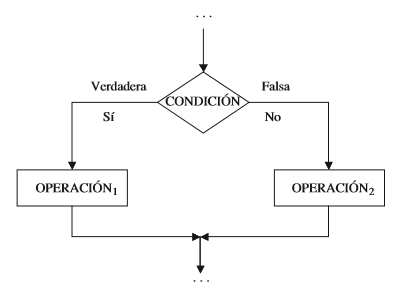
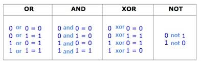

class: center, middle, inverse, layout
# Estructuras Repetitivas
## Taller Laboratorio 3

---

class: inverse
layout: true

---

# Estructuras selectivas

<center>



</center>

---

# Condiciones (operadores relacionales)

Reciben (operan) sobre dos datos y devuelven *true* o *false* 

<center>


</center>


---

# Condiciones (operadores lógicos)

Reciben sobre dos datos de tipo *bool* y devuelven *true* o *false* 

<center>



</center>


---
# Estructuras repetitivas


<center>


</center>


---
# Estructuras repetitivas (while)

¿Cómo repetimos algo 10 veces?

```
int cont = 0;
while(cont < 10){
	// hacer algo...
	cont = cont + 1;
}
```

La computadora necesita contar para saber cuántas veces repite:
* Iniciar contador
* Condición (para seguir repitiendo)
* Incrementar contador

---
# Estructuras repetitivas (for)

¿Cómo repetimos algo 10 veces?

```
for(int cont = 0; cont < 10; cont++){
	// hacer algo...
}
```

La computadora necesita contar para saber cuántas veces repite:
* Iniciar contador
* Condición (para seguir repitiendo)
* Incrementar contador


---
# Ejemplo #1

Escriba un programa que muestre su nombre 5 veces


---
# Ejemplo #2

Escribir un programa que le pida al usuario ingresar 10 valores enteros, para cada uno de esos valores, mostrar la mitad de dicho valor.

